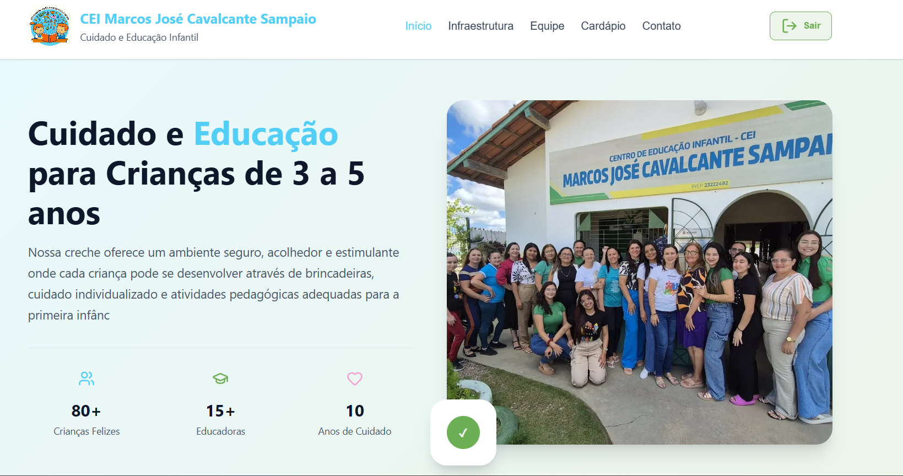
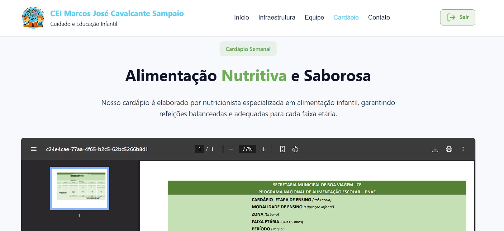

# Site da Creche - Projeto de Extensão UFC Quixadá

Este projeto é um website institucional para uma creche, desenvolvido como parte de um projeto de extensão universitária na UFC Quixadá. Nosso objetivo principal é fornecer uma plataforma acessível, fortalecendo a comunicação com a comunidade local e permitindo fácil gerenciamento pela creche.

---

## 📜 Índice

1.  [**Funcionalidades do Site**](#-funcionalidades-do-site)
2.  [**Tecnologias Utilizadas**](#-tecnologias-utilizadas)
3.  [**Estrutura do Projeto**](#-estrutura-do-projeto)
4.  [**Demonstração Visual**](#-demonstração-visual)
5.  [**Créditos e Agradecimentos**](#-créditos-e-agradecimentos)

-----

## 🚀 Funcionalidades do Site

O site foi projetado para ser intuitivo e fornecer as informações essenciais de maneira organizada, incluindo:

* Página Inicial com visão geral e destaques.
* Seção "Sobre Nós", apresentando a missão da creche.
* Galeria de fotos para exibir o ambiente e as atividades.
* Aba de professores.
* Página de contato para comunicação direta.

Todas as abas permitem gerenciamento por meio de um painel administrativo acessível apenas para usuários autorizados.
-----

## 🛠️ Tecnologias Utilizadas

Este projeto foi construído usando uma stack de tecnologias padrão para desenvolvimento web front-end, garantindo acessibilidade e compatibilidade.

| Tecnologia | Descrição |
| :--- | :--- |
| **HTML5** | Linguagem de marcação para estruturar o conteúdo do site. |
| **CSS3** | Linguagem de estilo para design e apresentação visual. |
| **JavaScript** | Linguagem de programação para adicionar interatividade e dinamismo ao site. |
| **FastAPI** | Framework web para construção de APIs em Python, utilizado para gerenciar a comunicação entre o front-end e o back-end. |

-----

## 🗂️ Estrutura do Projeto

O repositório está organizado de forma modular, seguindo boas práticas de desenvolvimento web:

* `css/`: Contém os arquivos de estilo CSS.
* `js/`: Contém os arquivos JavaScript para a lógica de front-end.
* `imgs/`: Armazena todas as imagens utilizadas no site.
* `partials/`: Possíveis trechos de HTML reutilizáveis.
* `index.html`: A página principal do site.

-----

## 📊 Demonstração Visual

Para ilustrar o design e a experiência do usuário, seguem algumas imagens do site em funcionamento:

Tela para gerenciamento de Professores

Tela para gerenciamento do Cardápio

---